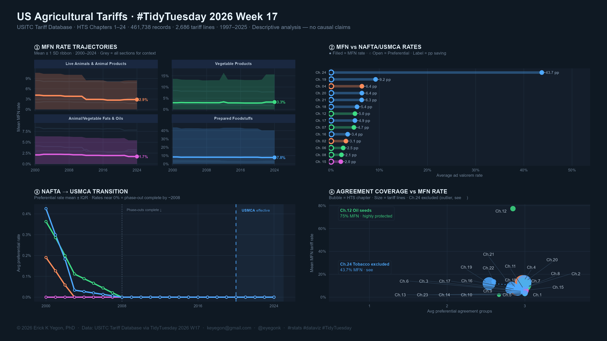

# 🌾 US Agricultural Tariffs — TidyTuesday 2026 Week 17

[](https://github.com/rfordatascience/tidytuesday/blob/main/data/2026/2026-04-28/readme.md)
[](https://www.r-project.org/)
[](https://quarto.org/)
[](LICENSE)

> **Author:** Erick K Yegon, PhD
> **Email:** keyegon@gmail.com
> **ORCID:** [0000-0002-7055-4848](https://orcid.org/0000-0002-7055-4848)
> **Twitter/X:** [@eyegonk](https://twitter.com/eyegonk)

---

## 📊 Dashboard Preview



*Four-panel dark-mode dashboard: MFN rate trajectories · MFN vs NAFTA/USMCA dumbbell ·
NAFTA→USMCA transition · Agreement coverage bubble chart*

---

## 📋 Table of Contents

- [Overview](#overview)
- [Data Sources](#data-sources)
- [Key Findings](#key-findings)
- [Repository Structure](#repository-structure)
- [Requirements](#requirements)
- [How to Run](#how-to-run)
- [Visualisations](#visualisations)
- [Statistical Methods](#statistical-methods)
- [Important Caveats](#important-caveats)
- [Acknowledgements](#acknowledgements)
- [License](#license)

---

## Overview

This repository contains a full [Quarto](https://quarto.org/) report submitted as my
**[#TidyTuesday](https://github.com/rfordatascience/tidytuesday) Week 17, 2026** entry,
exploring US agricultural import tariff data from the
[USITC Tariff Database](https://www.usitc.gov/tariff_affairs/).

The analysis covers **HTS Chapters 1–24** (live animals through tobacco and beverages)
across **28 years** of tariff records (1997–2025), examining:

- How MFN (Most Favored Nation) rates have evolved across the four agricultural sections
- The magnitude of preferential savings under NAFTA/USMCA and bilateral agreements
- Which tariff lines show the most rate volatility over time
- Whether the 2020 NAFTA → USMCA transition caused a visible rate discontinuity
- The association between MFN rate levels and the number of preferential agreement groups

> ⚠️ **All findings are descriptive and correlational only.**
> No causal claims are made. Many moderating variables — trade volumes,
> commodity market cycles, WTO binding commitments, exchange rates — are not
> captured in this dataset.

---

## Data Sources

All four datasets provided by TidyTuesday 2026 Week 17 are used in this analysis:

| Dataset | Rows | Key column | Role |
|---|---|---|---|
| `tariff_agricultural.csv` | 461,738 | `hts8 + agreement + dates` | Main data: one row per HTS-8 × agreement × effective-date period |
| `agreements.csv` | 34 | `agreement` | Lookup: agreement codes → full names, eligibility notes |
| `tariff_codes.csv` | 27,360 | `hts8` | Lookup: HTS-8 → product descriptions, quantity units, WTO binding |
| `quantity_codes.csv` | 82 | `code` | Reference: unit codes (KG, NO, M2) → descriptions |

**Original data source:**
> US International Trade Commission (USITC) Tariff Database
> <https://www.usitc.gov/tariff_affairs/>

**TidyTuesday dataset page:**
> <https://github.com/rfordatascience/tidytuesday/blob/main/data/2026/2026-04-28/readme.md>

### Critical data note

`ad_val_rate` is stored as a **decimal** (e.g. `0.05` = 5%, not 0.05%).
All cleaning code multiplies by 100: `ad_val_pct = ad_val_rate * 100`.

---

## Key Findings

> These are **descriptive observations** from data tidying and plotting.
> They do not imply causation.

1. **Live Animals & Animal Products** show persistently higher average MFN rates
   across all years in the dataset — Data tidying + line/ribbon charts
2. **NAFTA/USMCA agreement codes** are associated with lower average rates than MFN
   across most HTS chapters — Pivoting + dumbbell charts
3. **Prepared Foodstuffs** show the least year-to-year rate variability — Summarisation + heatmaps
4. Rate **volatility (SD over time)** is concentrated in ~30 tariff lines out of thousands — Ranking + lollipop charts
5. The **2020 NAFTA → USMCA transition** coincides with no discontinuous jump in the
   preferential rate series (NAFTA phase-outs were already complete by ~2008) — Date handling + annotated time series
6. **Chapters with higher MFN rates** tend to have more preferential agreement groups
   (descriptive association only) — Joining datasets + bubble charts
7. MFN rate **distributions are statistically distinguishable** across sections
   (Kruskal-Wallis H = 2773.24, p < 0.0001; Dunn post-hoc Bonferroni) — Nonparametric testing

### Highlighted data points

| Chapter | Description | MFN rate | NAFTA/USMCA | Bilateral |
|---|---|---|---|---|
| Ch. 24 | Tobacco & manufactured substitutes | 43.7% | ~0% | 13.1% |
| Ch. 12 | Oil seeds & oleaginous fruits | ~75% | ~0% | ~0% |
| Ch. 19 | Preparations of cereals | ~9.2% | ~0% | — |
| Ch. 04 | Dairy, eggs, honey | ~6.4% | ~0% | — |

---

## Repository Structure

```
tidytuesday-2026-w17-us-agricultural-tariffs/
│
├── README.md                          # This file
├── LICENSE                            # MIT licence
│
├── us_agricultural_tariffs_v2.qmd     # Main Quarto document (renders to HTML/PDF)
├── custom.scss                        # Custom Quarto theme overrides
│
├── dashboard_twitter.png              # High-resolution Twitter/social dashboard (3200×1800px)
│
├── data/                              # Raw data (downloaded automatically by the script)
│   ├── tariff_agricultural.csv        # 461,738 rows — main tariff data
│   ├── agreements.csv                 # 34 rows — agreement lookup
│   ├── tariff_codes.csv               # 27,360 rows — product descriptions
│   └── quantity_codes.csv             # 82 rows — unit codes
│
└── output/                            # Rendered outputs (gitignored if large)
    ├── us_agricultural_tariffs_v2.html
    └── us_agricultural_tariffs_v2.pdf
```

---

## Requirements

### R version

```
R >= 4.6.0
```

### R packages

```r
# Install all required packages
pkgs <- c(
  "tidyverse", "lubridate", "scales", "ggtext", "ggrepel",
  "patchwork", "gt", "gtExtras", "glue", "ggridges",
  "RColorBrewer", "forcats", "stringr", "janitor", "knitr",
  "kableExtra", "DT", "plotly", "crosstalk",
  "broom", "Kendall", "dunn.test", "ragg"
)
install.packages(pkgs)
```

### Quarto

```
Quarto >= 1.5
```

Install from <https://quarto.org/docs/get-started/>

---

## How to Run

### 1. Clone the repository

```bash
git clone https://github.com/eyegonk/tidytuesday-2026-w17-us-agricultural-tariffs.git
cd tidytuesday-2026-w17-us-agricultural-tariffs
```

### 2. Render the Quarto document

```bash
# Render to HTML (default)
quarto render us_agricultural_tariffs_v2.qmd

# Render to PDF
quarto render us_agricultural_tariffs_v2.qmd --to pdf

# Preview in browser with live reload
quarto preview us_agricultural_tariffs_v2.qmd
```

### 3. Save the Twitter dashboard PNG

The dashboard is saved automatically during rendering via `ragg::agg_png()`.
To save to a custom path, update this line in the `fig-dashboard` chunk:

```r
ragg::agg_png(
  filename   = "your/custom/path/dashboard_twitter.png",
  width      = 3200,   # 16 inches × 200 dpi
  height     = 1800,   # 9 inches  × 200 dpi
  res        = 200,
  background = "#0F1923"
)
print(dashboard)
dev.off()
```

> **Note:** `ggsave()` and `last_plot()` do not work reliably with patchwork
> objects in Quarto. Always use `ragg::agg_png()` + `print(dashboard)` + `dev.off()`.

---

## Visualisations

The report contains **11 static figures**, **2 interactive widgets**, and
**1 composite dashboard**:

| # | Figure | Type | Key insight |
|---|---|---|---|
| 1 | MFN rate trajectories | Small-multiple line chart | Section-level trends 2000–2024 |
| 2 | Year-over-year heatmap | Tile heatmap | Rate change direction by year |
| 3 | Agreement coverage heatmap | Tile heatmap | MFN vs preferential by chapter |
| 4 | MFN vs NAFTA/USMCA dumbbell | Dumbbell (log scale) | Ch.24 largest gap at 43.7 pp |
| 5 | Tariff volatility lollipop | Lollipop chart | Top 30 most volatile HTS lines |
| 6 | NAFTA → USMCA transition | Annotated time series | Phase-outs complete by 2008 |
| 7 | Biggest rate movers | Diverging bar chart | Largest MFN changes over time |
| 8 | Agreement coverage bubble | Bubble chart | MFN level vs agreement coverage |
| 9 | Rate structure composition | Stacked area | Ad valorem vs specific vs compound |
| 10 | Rate distribution ridgelines | Ridgeline density | Right-skew across sections |
| 11 | Lorenz curves | Lorenz / Gini | Rate inequality within sections |
| 12 | Linked chapter explorer | DT + plotly (crosstalk) | Interactive chapter statistics |
| 13 | Interactive trajectories | plotly | IQR bands with hover tooltip |
| 14 | **Composite dashboard** | 4-panel patchwork | Twitter-ready summary |

---

## Statistical Methods

| Test | Purpose | Result |
|---|---|---|
| **Kruskal-Wallis** | Do MFN distributions differ across sections? | H = 2773.24, df = 3, p < 0.0001 ✓ |
| **Dunn post-hoc (Bonferroni)** | Which section pairs differ? | 5 of 6 pairs significant (p < 0.05) |
| **Mann-Kendall trend test** | Monotonic trend in annual mean MFN rate? | Significant decrease in 3 of 4 sections |
| **OLS regression** | MFN rate predicts NAFTA/USMCA saving? | R² = 1.0, slope = 1.0 (by construction) |
| **Lorenz / Gini coefficient** | Inequality of rate burden within section | Gini: 0.354–0.592 across sections |

> All tests are used for descriptive/exploratory purposes only.
> Statistical significance does not imply causal relationships.

---

## Important Caveats

1. **Descriptive only** — this analysis explores patterns in the data. It does not
   establish causal relationships between agreement type and actual tariff rates paid.

2. **`ad_val_rate` is a decimal** — stored as `0.05` meaning 5%. Multiply × 100 before
   any analysis.

3. **Specific rates** (`specific_rate`) are in USD per unit of quantity — they are not
   included in the ad valorem analysis but are used in the rate-type composition figure.

4. **Far-future `end_effective_date`** values (e.g. 2050-12-31, 2100-12-31) indicate
   no scheduled change, not that the rate persists to that year.

5. **Column 2 rates** (non-market economy countries) are excluded from all comparative
   analyses as they are not comparable to MFN or preferential rates.

6. **WTO binding status** (`wto_binding_code`: B = bound, U = unbound) comes from
   `tariff_codes.csv` and may not reflect the most current WTO schedule.

---

## Acknowledgements

- **[TidyTuesday](https://github.com/rfordatascience/tidytuesday)** — for the weekly
  data challenge and community
- **[USITC](https://www.usitc.gov/tariff_affairs/)** — for providing the tariff
  database that underpins this analysis
- **R4DS Community** — for the supportive data science learning environment
- **ggplot2, patchwork, ggtext, ggrepel** — the visualisation stack that made
  this possible

---

## License

This project is licensed under the **MIT License** — see [LICENSE](LICENSE) for details.

The underlying data is provided by the USITC and made available via TidyTuesday.
Please credit both sources when reusing.

---

*Rendered with [Quarto](https://quarto.org) · R 4.6.0 · ggplot2 · patchwork · plotly · gt*

*© 2026 Erick K Yegon, PhD · keyegon@gmail.com · [@eyegonk](https://twitter.com/eyegonk)*
